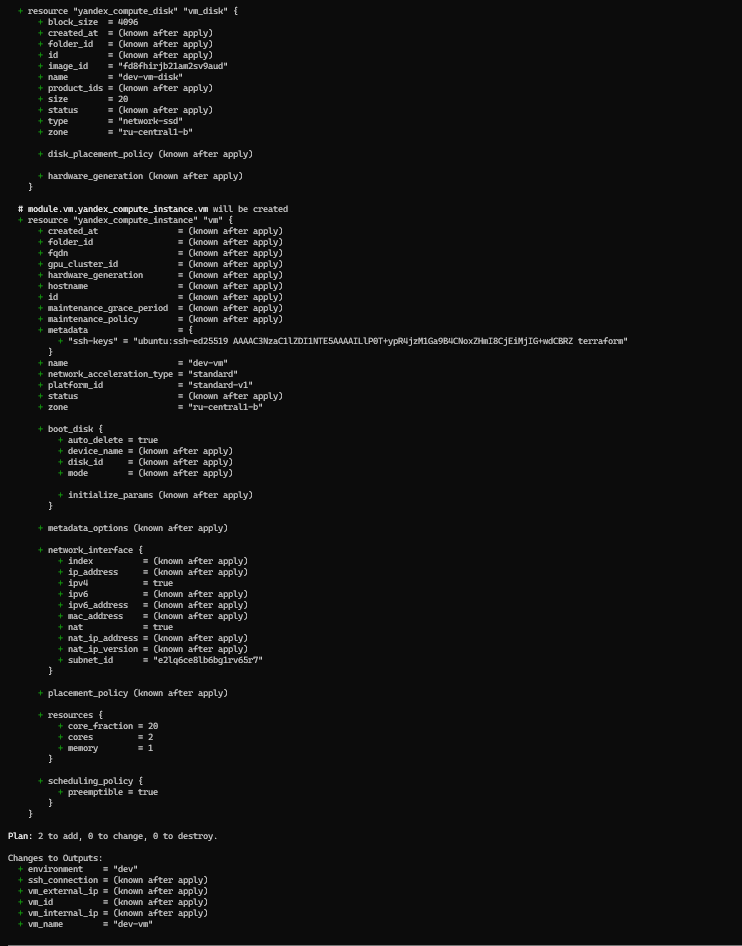
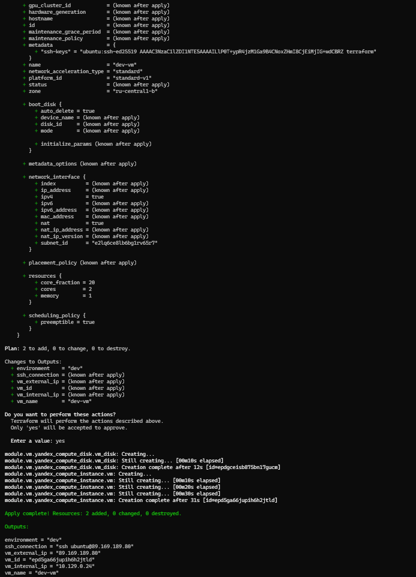
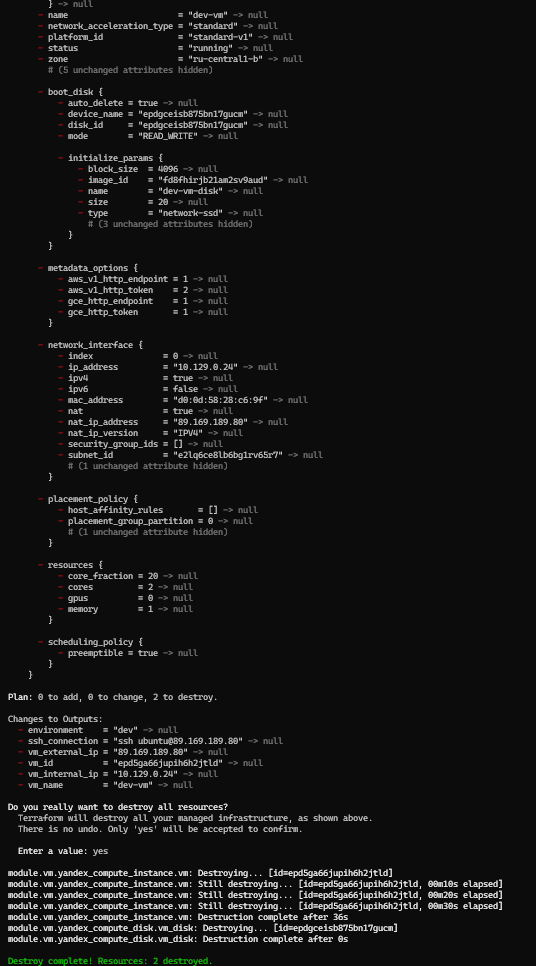
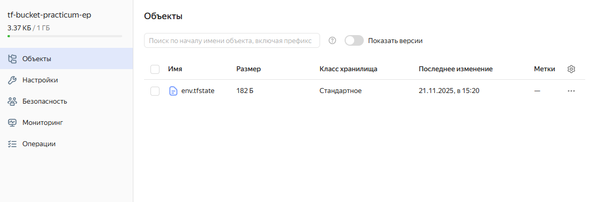

# Модульная инфраструктура для нескольких сред

- dev - инфраструктура для разработки и отадки (20% использования ядер)
- stage - инфраструктура для тестирования функционала (50% использования ядер)
- prod - инфраструктура для релизного функционала (100% использования ядер)

```
modules/
└── vm/
    ├── main.tf
    ├── variables.tf
    └── outputs.tf
envs
├── dev
    ├── env.tfvars
    ├── main.tf
    ├── variables.tf
    └── outputs.tf
├── stage
    ├── env.tfvars
    ├── main.tf
    ├── variables.tf
    └── outputs.tf
└── prod
    ├── env.tfvars
    ├── main.tf
    ├── variables.tf
    └── outputs.tf
```
## Параметры
| Параметр | Тип | Описание |
|----------|-----|----------|
| `vm_name` | string | Имя ВМ |
| `subnet_id` | string | ID подсети |
| `ssh_public_key` | string | Публичный SSH-ключ |

### Опциональные
| Параметр | Тип | По умолчанию | Описание |
|----------|-----|--------------|----------|
| `vm_cores` | number | 2 | Количество ядер |
| `vm_core_fraction` | number | 20 | % Использования ядер |
| `vm_memory` | number | 4 | RAM в ГБ |
| `vm_disk_size` | number | 20 | Размер диска в ГБ |
| `vm_disk_type` | string | "network-ssd" | Тип диска |
| `image_family` | string | "ubuntu-2204-lts" | Образ ОС |
| `zone` | string | "ru-central1-b" | Зона доступности |
| `platform_id` | string | "standard-v1" | Платформа |
| `environment` | string | - | Окружение (dev/stage/prod) |

## Выходные значения

| Параметр | Описание |
|----------|----------|
| `vm_id` | ID ВМ |
| `vm_external_ip` | Внешний IP |
| `vm_internal_ip` | Внутренний IP |
| `ssh_connection` | Команда SSH подключения |
| `disk_id` | ID диска |

### Пример запуска

```bash
cd envs/dev
terraform init
terraform plan -var-file="env.tfvars"
```


```bash
terraform apply -var-file="env.tfvars"
```


``` bash
terraform destroy -var-file="env.tfvars"
```


### Backend s3 state

