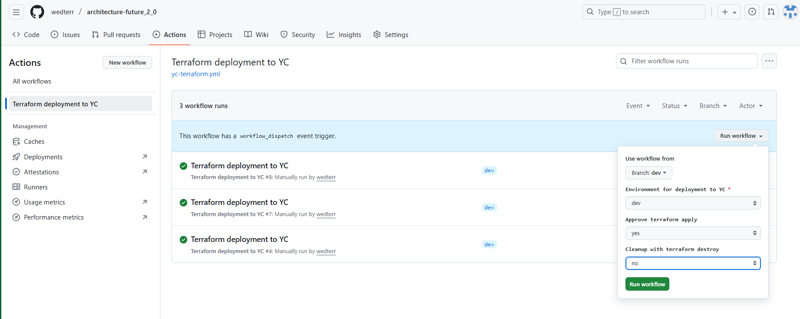
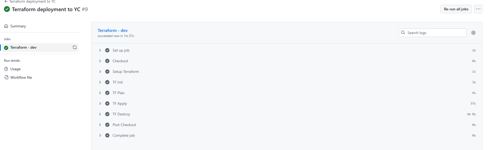
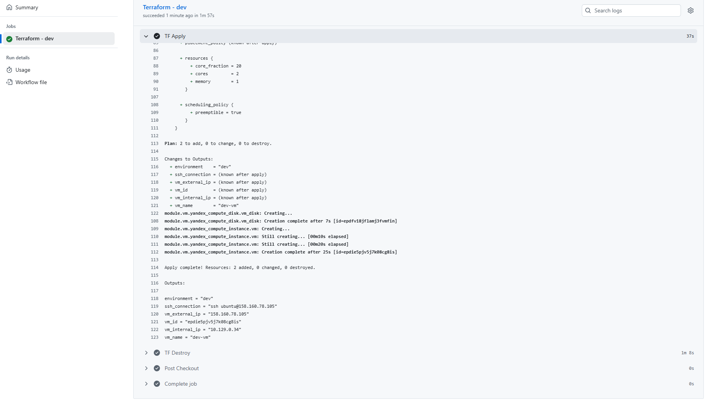

# Интеграция с CI/CD и удалённым хранением состояния

[Pipeline .yml](../.github/workflows/yc-terraform.yml)


Инициализация terraform с указанием ключей к S3 backend.
```yml
- name: TF Init
  run: |
    cd envs/${{ github.event.inputs.environment }}
    terraform init \
      -backend-config="access_key=${{ secrets.YC_ACCESS_KEY_ID }}" \
      -backend-config="secret_key=${{ secrets.YC_ACCESS_KEY_SECRET }}"
```

Стадия планирования terraform
```yml
- name: TF Plan
  run: |
    cd envs/${{ github.event.inputs.environment }}
    terraform plan \
      -var="yandex_token=${{ secrets.YANDEX_TOKEN }}" \
      -var="cloud_id=${{ secrets.YC_CLOUD_ID }}" \
      -var="folder_id=${{ secrets.YC_FOLDER_ID }}" \
      -var="subnet_id=${{ secrets.YC_SUBNET_ID }}" \
      -var="ssh_public_key=${{ secrets.SSH_PUBLIC_KEY }}"
```

Деплой в YC при выборе apply yes
```yml
- name: TF Apply
  if: ${{ github.event.inputs.approve == 'yes' }}
  run: |
    cd envs/${{ github.event.inputs.environment }}
    terraform apply -auto-approve \
      -var="yandex_token=${{ secrets.YANDEX_TOKEN }}" \
      -var="cloud_id=${{ secrets.YC_CLOUD_ID }}" \
      -var="folder_id=${{ secrets.YC_FOLDER_ID }}" \
      -var="subnet_id=${{ secrets.YC_SUBNET_ID }}" \
      -var="ssh_public_key=${{ secrets.SSH_PUBLIC_KEY }}"
```

Удаление в YC при выборе destroy yes
```yml
- name: TF Destroy
  if: ${{ github.event.inputs.destroy == 'yes' }}
  run: |
    cd envs/${{ github.event.inputs.environment }}
    terraform destroy -auto-approve \
      -var-file="env.tfvars" \
      -var="yandex_token=${{ secrets.YANDEX_TOKEN }}" \
      -var="cloud_id=${{ secrets.YC_CLOUD_ID }}" \
      -var="folder_id=${{ secrets.YC_FOLDER_ID }}" \
      -var="subnet_id=${{ secrets.YC_SUBNET_ID }}" \
      -var="ssh_public_key=${{ secrets.SSH_PUBLIC_KEY }}"
```



