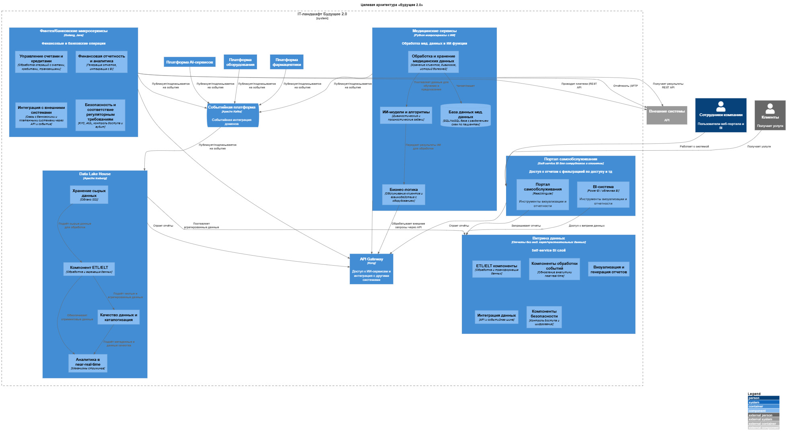

# Целевая архитектура системы «Будущего 2.0»

# Карта рисков трансформации

### Архитектурные риски
- Неправильное разделение данных по доменам (Data Mesh)  
  - Вероятность: средняя  
  - Влияние: высокое  
  - Описание: Неправильное владение и ответственность за данные грозит потерей качества данных, дублированием и сложностью интеграции, что замедлит аналитику и приведет к ошибкам.

- Потеря производительности при масштабировании  
  - Вероятность: средняя  
  - Влияние: высокое  
  - Описание: Переход с DWH на облачные решения может вызвать сложность оптимизации запросов и потоков данных, что скажется на time-to-market и скорости отчётности.

- Устаревание используемых технологий и сложность миграции легаси-систем  
  - Вероятность: высокая  
  - Влияние: среднее  
  - Описание: SQL Server 2008 и PowerBuilder создают технологический долг, миграция требует значительных ресурсов и времени.

### Организационные риски
- Сложности в координации кросс-функциональных команд  
  - Вероятность: высокая  
  - Влияние: высокое  
  - Описание: Отделение доменов и распределение ответственности требует сильной командной работы и коммуникаций; ошибки ведут к замедлению проектов и снижению качества данных.

- Низкий уровень зрелости управления данными и безопасности в Data Mesh  
  - Вероятность: средняя  
  - Влияние: высокое  
  - Описание: Новые подходы требуют строгого контроля, особенно в медицинском и финансовом сегменте, где регуляторные требования высоки.

- Сопротивление изменениям и навыкам сотрудников  
  - Вероятность: высокая  
  - Влияние: среднее  
  - Описание: Переход на новые технологии требует обучения и принятия изменений, иначе задержки и ошибки неизбежны.

### Технологические риски
- Безопасность и защита данных при распределенной архитектуре  
  - Вероятность: средняя  
  - Влияние: высокое  
  - Описание: Распределённость данных по доменам усложняет централизованный контроль доступа и защиту медицинских и финансовых данных.

- Недостаточная автоматизация и сложность поддержки при масштабировании  
  - Вероятность: средняя  
  - Влияние: среднее  
  - Описание: Увеличение количества пользователей и сценариев требует автоматизации мониторинга, управления доступом и обработки данных.

- Сложности интеграции разнородных систем (ИИ-сервисы, финтех, медтехника)  
  - Вероятность: средняя  
  - Влияние: высокое  
  - Описание: Несовместимости и задержки во взаимодействии могут снизить качество и скорость бизнеса.

# План управления рисками

### Архитектурные риски
- Зависимость от облачного провайдера  
  - Меры: Использовать мультиоблачную или гибридную архитектуру для снижения влияния сбоев одного провайдера; внедрять механизмы аварийного переключения и резервного копирования. Регулярно тестировать планы восстановления и отказоустойчивости.  
  - Тип меры: технические  
- Сложность миграции и согласования бизнес-логики  
  - Меры: Четко документировать бизнес-правила и процессы, выделять миграционные этапы с поэтапным тестированием; использовать автоматизацию тестирования и CI/CD; вовлекать всех стейкхолдеров для синхронизации ожиданий.  
  - Тип меры: управленческие + технические  
- Перегрузка DWH бизнес-логикой  
  - Меры: Перенос бизнес-логики из DWH в микросервисы и аналитические сервисы; оптимизация моделей данных; внедрение event-driven архитектуры, разгрузка DWH через дата-лейки.  
  - Тип меры: технические

### Организационные риски
- Недостаточная квалификация персонала  
  - Меры: Организация обучающих программ по облачным технологиям и event-driven архитектурам; найм профильных специалистов; внутрикомандное наставничество.  
  - Тип меры: управленческие  
- Сопротивление изменению  
  - Меры: Активное вовлечение сотрудников в процесс изменений, разъяснительная работа, прозрачное управление изменениями (change management), мотивация адаптации.  
  - Тип меры: управленческие

### Технологические риски
- Утечки и нарушения безопасности данных  
  - Меры: Внедрение комплексных мер информационной безопасности (шифрование данных в покое и при передаче, многофакторная аутентификация, DLP-системы); регулярный аудит и тестирование безопасности; соответствие регуляторным требованиям.  
  - Тип меры: технические  
- Ошибки конфигураций облачных ресурсов  
  - Меры: Использование автоматизации и шаблонов инфраструктуры как кода (IaC), регулярные проверки и мониторинг конфигураций, обучение сотрудников, ведение журналов изменений.  
  - Тип меры: технические  
- Ограничения облачной платформы  
  - Меры: Проведение пилотных проектов для оценки функционала, выбор платформ с возможностью масштабирования, использование дополнительных инструментов при необходимости.  
  - Тип меры: управленческие + технические

| Категория риска | Риск                                     | Вероятность | Влияние | План управления и меры снижения                                           | Тип мер                      |
| --------------- | ---------------------------------------- | ----------- | ------- | ------------------------------------------------------------------------- | ---------------------------- |
| Архитектурные   | Зависимость от облачного провайдера      | Высокая     | Высокое | Мультиоблачная архитектура, аварийное переключение, резервное копирование | Технические                  |
| Архитектурные   | Сложность миграции и согласования логики | Высокая     | Среднее | Документация бизнес-логики, поэтапная миграция, автоматизация тестов      | Управленческие + технические |
| Архитектурные   | Перегрузка DWH бизнес-логикой            | Средняя     | Высокое | Перенос логики в микросервисы и дата-лейки, оптимизация моделей данных    | Технические                  |
| Организационные | Недостаточная квалификация персонала     | Средняя     | Среднее | Обучающие программы, найм специалистов, наставничество                    | Управленческие               |
| Организационные | Сопротивление изменениям                 | Средняя     | Среднее | Вовлечение сотрудников, управление изменениями, мотивация                 | Управленческие               |
| Технологические | Утечки и нарушения безопасности данных   | Средняя     | Высокое | Шифрование, многофакторная аутентификация, аудит безопасности             | Технические                  |
| Технологические | Ошибки в конфигурации облачных ресурсов  | Средняя     | Среднее | Инфраструктура как код, мониторинг, обучение, журналы изменений           | Технические                  |
| Технологические | Ограничения облачной платформы           | Низкая      | Среднее | Пилотные проекты, выбор масштабируемых платформ, инструменты расширения   | Управленческие + технические |