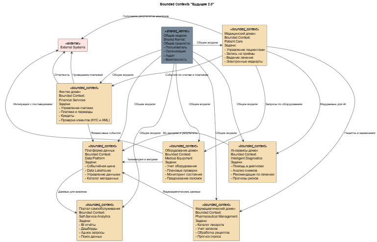
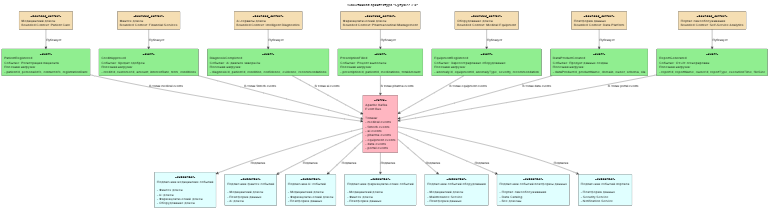

# Моделирование домена и интеграций

- [bounded-contexts.puml](./bounded-contexts.puml) - схема bounded contexts.

- [event-storming.puml](./event-storming.puml) - Event Storming.

- [aggregates.md](./aggregates.md) - описание агрегатов (границы, инварианты, ключи).
- [events.md](./events.md) - каталог доменных событий 
- [justification.md](./justification.md) - обоснование событийного подхода vs Camel/DWH.